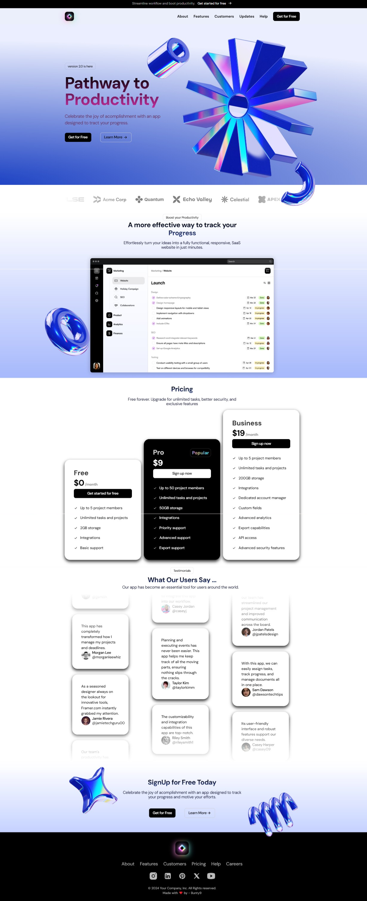

## Next JS Stunning SaaS Landing Page

A smooth eye-catching webpage built with cutting-edge tools like NextJs and Tailwind and Framer Motion.

- Next JS and React JS webpage
- Tailwind styles
- Framer motion animations
- Paralax effect on images
- Infinite corrousel on testimonials
- Dockerized Deployment: Fully containerized application for easy setup and deployment.

## Setup your own page 🚀

Follow these steps to set up and explore the Next Js website.

1. **Clone the Repository**:

   ```bash
   git clone https://github.com/Bunty9/saas-landing-next.git
   ```

   Clone the repository to your local machine using the provided repository URL.

2. **Launch Application in Docker**:

   ```bash
   docker-compose up --build
   ```

   Start the node server. Run this command within the main `sass-landing-next` directory. The server will be live at the specified port.

## Screenshot


